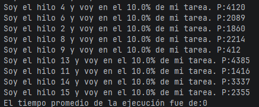
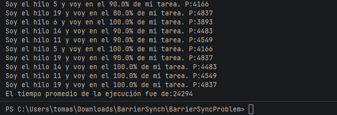

# TomasEspitia-Lab2-ARSW
---

## Punto 2a

### ¿Cuál es el resultado obtenido? (revise el mensaje : “el tiempo promedio de la ejecución fue de …”). 
- 
### ¿es correcto?
- No. El resultado esperado debería ser el promedio real de los tiempos de ejecución de los 20 hilos (un valor del orden de miles de milisegundos), no cero.

### ¿por qué se da este resultado?
- El método main lanza los 20 hilos con start() y de inmediato, sin esperar a que terminen, recorre el arreglo llamando hilos[i].getResultado(). En ese momento, la mayoría de los hilos aún están ejecutándose (o incluso apenas iniciando), por lo que el campo resultado de cada HiloProc conserva su valor inicial de 0. El promedio calculado es entonces 0/20 = 0.

---

## Punto 3
- Se implementó el patrón de sincronización por barrera usando java.util.concurrent.CountDownLatch. Se inicializa el latch con el número de hilos (20), cada HiloProc recibe una referencia a él y llama latch.countDown() al finalizar su run(). El hilo principal llama latch.await() inmediatamente después de lanzar los hilos, bloqueándose hasta que el contador llegue a cero, es decir, hasta que el último hilo termine.
- Vemos como se ve al final.
- 
